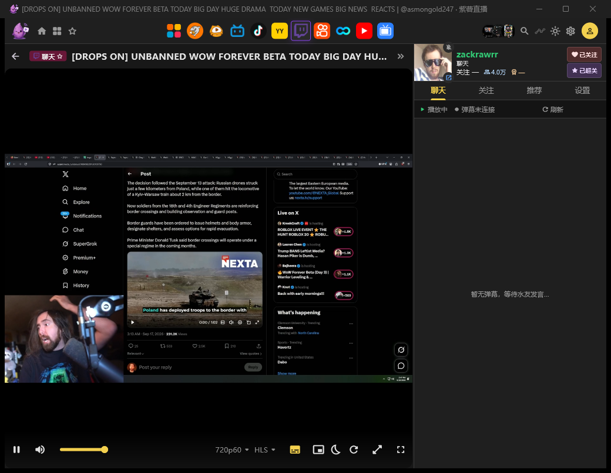

# zishu_flutter（紫薯直播 Flutter 客户端）

目标平台为 Web、Windows、Android，客户端技术核心是 **Flutter + media-kit**。

- Web：Flutter UI 通过 Dart `streaming-server` HTTP/SSE/WebSocket 使用解析能力。
- Windows / Android：直接 import 独立纯 Dart `live_parser` package；当前优先完成 Windows。
- 三端共享业务模型、解析接口和用例；解析 package 不依赖 Flutter Widget、media-kit 或具体平台。
- 旧实现已统一归档到 `lib/legacy/`，新功能只在 `lib/src/` 开发。

详细目录和依赖规则见 [`docs/architecture.md`](docs/architecture.md)，完整实施路线见 [`docs/implementation-plan.md`](docs/implementation-plan.md)。

## 截图

| Windows 聚合首页（多平台 tabs + 分类抽屉 + 房间卡片网格） | Windows 播放页（Twitch 真实播放 + 聊天侧栏 + 控制条） |
|---|---|
|  |  |

## 平台进度（2026-09-30，HEAD `cadec5f`）

优先级 Windows > Web > Android。

| 平台 | 状态 | 说明 |
|---|---|---|
| Windows | ✅ 可用 | Flutter UI + 直连 `live_parser` + `media-kit` 主链路闭环：浏览 → 播放 → 弹幕 → 关注 → 设置；真实解析 Release 由 `v*` tag 自动打包（v1.0.4-beta）；长播稳定性与多站弹幕可靠性仍在持续打磨（缺口清单见 [`docs/platform-progress-audit.md`](docs/platform-progress-audit.md)） |
| Web（新 UI） | 🚧 规划中 | Dart `streaming-server`（P8）与新 Flutter Web 入口尚未建立；旧 legacy Web 壳仍可回归（`lib/legacy/main_web.dart`） |
| Android | ⏳ 未开始 | 尚无 `android/` 工程；共享 UI 已完成手机/平板响应式适配并通过设备矩阵测试，待建 runner 与平台播放适配 |

## 功能进度

### 解析核心（`packages/live_parser`，纯 Dart）

- 已接入 10 站：斗鱼、虎牙、B站、抖音、快手、YY、Twitch、SOOP、YouTube、小红书，外加全平台 cross 聚合；各站按能力声明（如快手/YouTube 无搜索），不伪造入口。
- 每站覆盖取流（多线路/多画质、偏好档懒取流）、分类浏览、搜索、弹幕协议中的可用子集；进房解析带 60s 结果缓存与并发合并，热解析归零。
- 签名/风控纯 Dart 实现：斗鱼 `getEncryption` md5 auth、抖音 a_bogus/X-Bogus、B站 wbi + 登录 Cookie 管道、小红书签名移植。

### 客户端 UI（`lib/src`）

- 页面：聚合首页、分类（分组 tabs + 子分类两形态）、搜索（防抖 + 直达）、关注（三密度/批量/特别关注/抖音关注导入）、主播页、时间线、设置。
- 播放页：四态舞台 + 画质/线路条 + 328px 聊天侧栏（弹幕 overlay、粉丝牌/徽章对齐官方渲染、用户名 hash 着色）、PiP 与全屏。
- 设置：深/浅主题、主题色 token 外置 JSON 热更（免重打包）、平台凭证弹框管理、按平台默认画质。
- 响应式：<768 底部导航、768–1023 平台 tab icon-only 收缩、窄屏播放页侧栏堆叠/横屏 sheet 化。

### 播放内核与稳定性

- `media-kit` 播放 + 本地流代理（对齐官方 DySDKController 架构）、URL 寿命预刷新、6s 缓冲对齐。
- 断流恢复：致命传输诊断 → re-resolve 换线/降档，死节点负缓存；切房统一 `room_release` 资源埋点（RSS/耗时）。
- mpv 直播调优改为外部配置文件驱动。

### 语音字幕（`packages/speech2zh`，纯 Dart）

- 流式 ASR（sherpa-onnx 可插拔）+ 模型管理 + 分句翻译流水线；采集当前走 Windows WASAPI。

### 测试与 CI

- `flutter analyze` + `flutter test` + `packages/live_parser` dart test（fixtures 全离线）；UI workflow 参数化测试与手机/平板/横屏/SafeArea/大字体设备矩阵。
- GitHub Actions：`v*` tag 自动构建 `zishu_flutter-<tag>-win64.zip` 并挂到 Release（`beta` 标 prerelease）。

## 运行

```powershell
# 新 Windows 客户端
flutter run -d windows -t lib/main.dart

# 旧 Web 回归
flutter run -d chrome -t lib/legacy/main_web.dart
flutter build web -t lib/legacy/main_web.dart
```

## 验证

```powershell
flutter analyze
flutter test
.\tool\build-web.ps1
```

## 许可

按需复制自 pure_live（AGPL-3.0）的代码随之传染 AGPL；本仓库私有自用，对外分发前需整体 AGPL-3.0。
